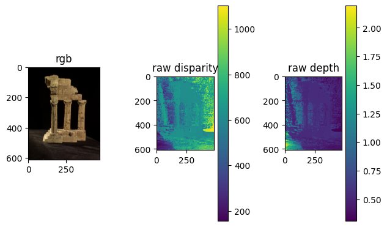
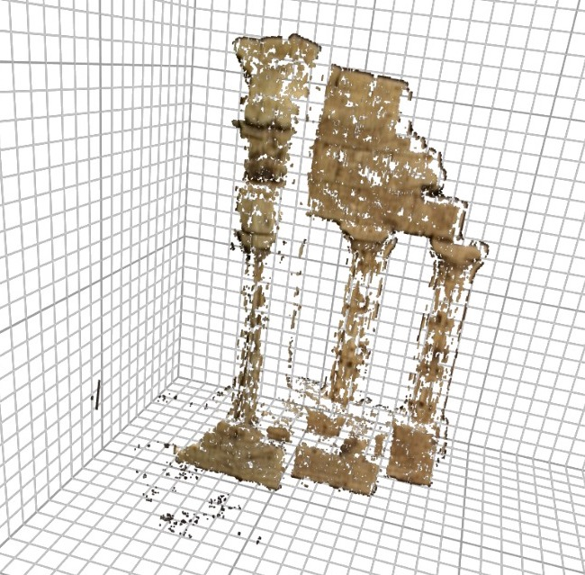
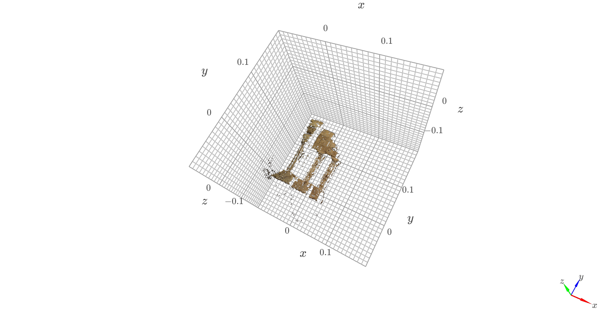
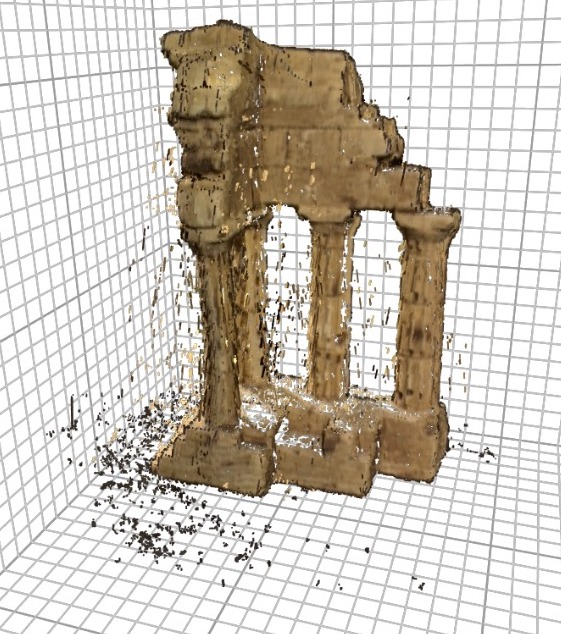

# 3D-reconstruction-multi-view-stereo
Implementation of two-view stereo and multi-view stereo algorithms to convert multiple 2D viewpoints into a 3D reconstruction of the scene.

### **Disparity and depth after post processing**:  

### **L-R Consistency check mask**:  

Reconstructed 3d model from 2 views using ZNCC Kernel -

Reconstructed 3d model from 2 views using ssd Kernel -

Entire Reconstructed 3d model -  

